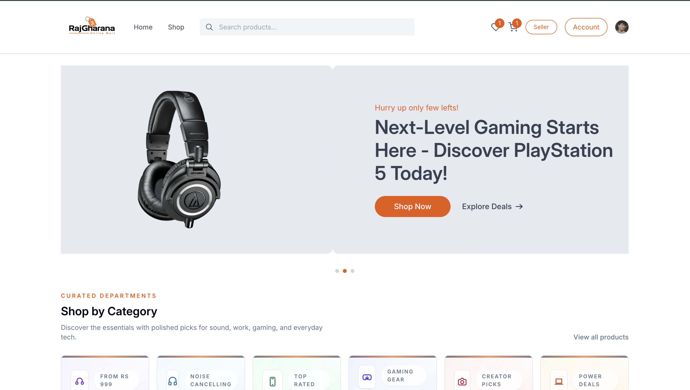
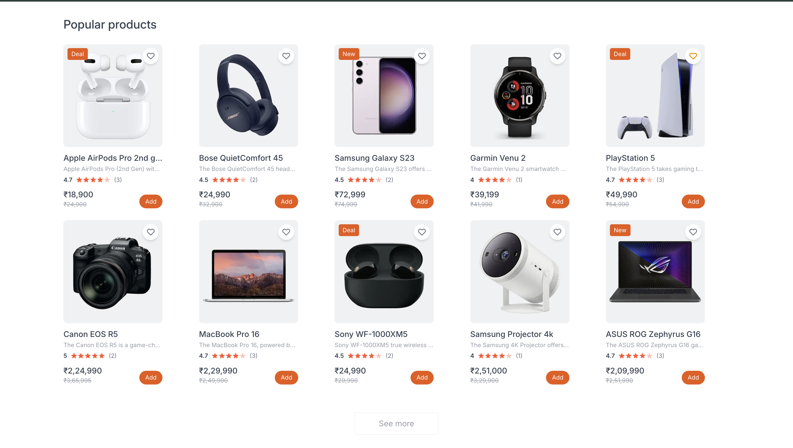
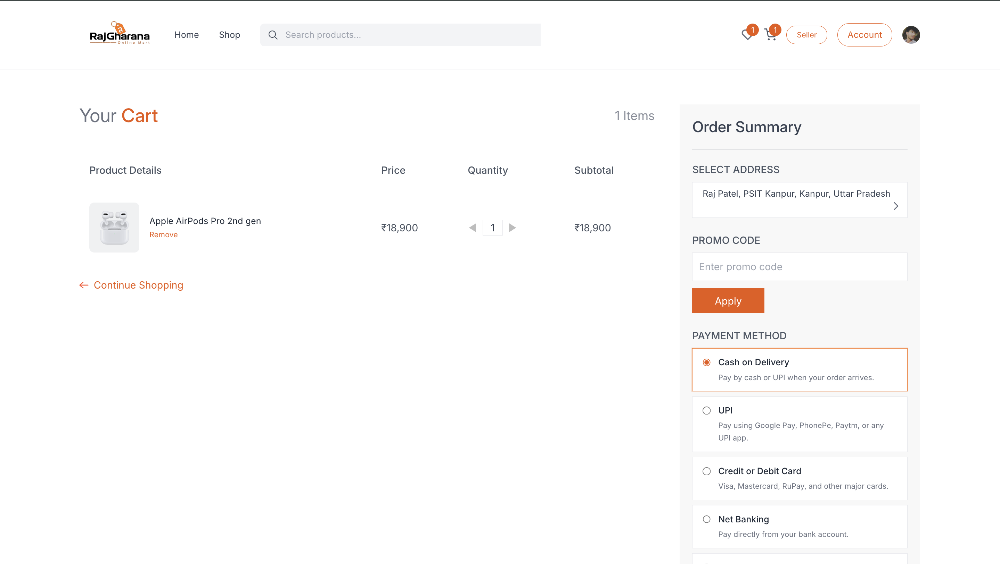

<p align="center">
  
</p>
<p align="center">
  A full-stack eCommerce storefront with secure authentication, product discovery,
  seller tools, persistent orders, and online payments.
</p>

<p align="center">
  <a href="https://raj-gharana.vercel.app/">
    
  </a>
  <a href="https://github.com/Rajpatel2924/RajGharana">
    
  </a>
</p>

<p align="center">
  <a href="https://raj-gharana.vercel.app/">
    
  </a>
</p>

---

## Overview

RajGharana is a responsive eCommerce application built with the Next.js App
Router. It combines an animated storefront experience with practical shopping
workflows, including Clerk authentication, product search and filtering,
wishlist and cart management, Razorpay checkout, Supabase order persistence,
order tracking, account management, and seller tools.

## Features

### Storefront and Product Discovery

- Animated responsive navigation with search, location, and language controls
- Homepage slider, category gallery, deal of the day, featured products, and promotional sections
- Product catalog with category, price, rating, and badge filters
- Product sorting by relevance, price, rating, and newest
- Detailed product pages with image gallery, specifications, ratings, reviews, and recommendations
- Responsive layouts for desktop and mobile devices

### Shopping Experience

- Persistent shopping cart with quantity controls and calculated totals
- Persistent wishlist with item counters
- Delivery address creation and selection
- Cash on delivery and Razorpay online payment options
- Payment signature verification through server-side API routes
- Order confirmation and detailed order timelines
- Supabase-backed order storage and order history

### Authentication and Account

- Clerk-powered sign-in, sign-up, session management, and user profile
- Protected storefront routes using Clerk middleware
- Account dashboard for profile, addresses, orders, wishlist, and payment information

### Seller Tools

- Seller dashboard
- Add and manage locally stored products
- Product listing view
- Seller order management view

## Tech Stack

| Area | Technologies |
| --- | --- |
| Framework | Next.js 15 App Router, React 19 |
| Styling | Tailwind CSS 3 |
| Authentication | Clerk |
| Database | Supabase PostgreSQL |
| Payments | Razorpay |
| State and Storage | React Context, browser localStorage |
| UI Utilities | React Hot Toast, OGL |
| Deployment | Vercel |

## Project Preview

### Homepage

<p align="center">
  
</p>

### Product Catalog

<p align="center">
  
</p>

### Checkout

<p align="center">
  
</p>

## Project Structure

```text
RajGharana/
├── app/                 # App Router pages and API routes
├── assets/              # Product data, images, and icons
├── components/          # Storefront, checkout, and seller components
├── context/             # Shared application state
├── lib/                 # Clerk and Supabase helpers
├── public/              # Public static assets
├── screenshots/         # README preview images
├── supabase/            # Database schema and policies
├── middleware.ts        # Clerk route protection
└── RAZORPAY_SETUP.md    # Detailed Razorpay setup guide
```

## Getting Started

### Prerequisites

- Node.js 18.18 or newer
- npm
- Clerk application
- Supabase project
- Razorpay account for online payments

### Installation

```bash
git clone https://github.com/Rajpatel2924/RajGharana.git
cd RajGharana
npm install
cp .env.example .env.local
```

Add your credentials to `.env.local`:

```env
# Clerk
NEXT_PUBLIC_CLERK_FRONTEND_API=
NEXT_PUBLIC_CLERK_PUBLISHABLE_KEY=
CLERK_SECRET_KEY=

# Razorpay
RAZORPAY_KEY_ID=
NEXT_PUBLIC_RAZORPAY_KEY_ID=
RAZORPAY_KEY_SECRET=
NEXT_PUBLIC_CURRENCY=₹

# Supabase
NEXT_PUBLIC_SUPABASE_URL=
NEXT_PUBLIC_SUPABASE_ANON_KEY=
SUPABASE_SERVICE_ROLE_KEY=
```

Never commit `.env.local` or expose server-side secret keys.

### Supabase Setup

1. Open the SQL editor in your Supabase project.
2. Run the schema from [`supabase/orders.sql`](./supabase/orders.sql).
3. Add the Supabase project URL and keys to `.env.local`.

The included SQL policies allow anonymous order inserts and reads for
development. Replace them with authenticated, user-scoped Row Level Security
policies before using the application in production.

### Run Locally

```bash
npm run dev
```

Open [http://localhost:3000](http://localhost:3000).

## Payment Flow

1. The customer selects a delivery address and payment method.
2. `/api/create-order` creates a Razorpay order for online payments.
3. Razorpay Checkout collects the payment.
4. `/api/verify-payment` verifies the payment signature on the server.
5. The completed order is persisted through `/api/orders`.
6. The customer is redirected to the order confirmation page.

See [`RAZORPAY_SETUP.md`](./RAZORPAY_SETUP.md) for detailed setup and testing
instructions.

## API Routes

| Route | Method | Purpose |
| --- | --- | --- |
| `/api/orders` | `GET` | Retrieve persisted orders |
| `/api/orders` | `POST` | Store a completed order |
| `/api/create-order` | `POST` | Create a Razorpay order |
| `/api/verify-payment` | `POST` | Verify a Razorpay payment signature |

## Deployment

The application is deployed on Vercel:

**[https://raj-gharana.vercel.app/](https://raj-gharana.vercel.app/)**

To deploy your own instance:

1. Import the repository into Vercel.
2. Add every variable from `.env.example` to the Vercel project settings.
3. Configure the variables for the Production environment.
4. Deploy or redeploy the project after changing environment variables.

## Available Scripts

```bash
npm run dev      # Start the development server
npm run build    # Create a production build
npm run start    # Run the production build
```

## Roadmap

- User-scoped Supabase Row Level Security policies
- Inventory and stock management
- Seller analytics dashboard
- Invoice generation
- Real multilingual content
- Personalized product recommendations

## Contributing

Contributions are welcome. Fork the repository, create a focused feature
branch, and open a pull request describing your changes.

```bash
git checkout -b feature/your-feature
git commit -m "Add your feature"
git push origin feature/your-feature
```

## License

This project is licensed under the [MIT License](./LICENSE).

## Developer

Built by **Raj Patel**.

- [GitHub](https://github.com/Rajpatel2924)
- [LinkedIn](https://www.linkedin.com/in/rajpatel2924)
- Email: `rajpatel805233@gmail.com`
